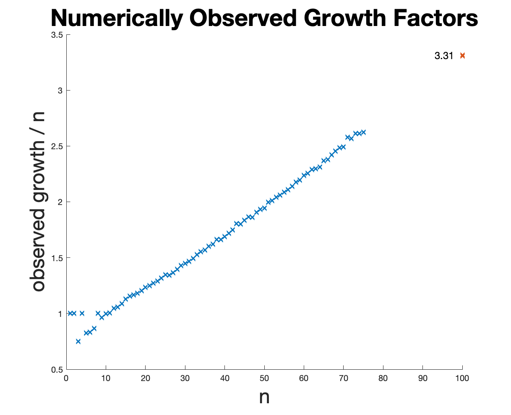

Matrices and code to accompany (files in .jld (julia data) format, we may put in text files some day)

SOME NEW RESULTS ON THE MAXIMUM GROWTH FACTOR IN
GAUSSIAN ELIMINATION
by Alan Edelman and John Urschel

Understanding  and bounding the growth factor for Gaussian elimination has 
intrigued mathematical numerical linear algebraists for many decades.  It is one of those
beautiful problems that is quite easy to state, and yet we still know so very little,
especially in the context of complete pivoting.  This may seem even more surprising
as the problem has been around for more than six decades.

